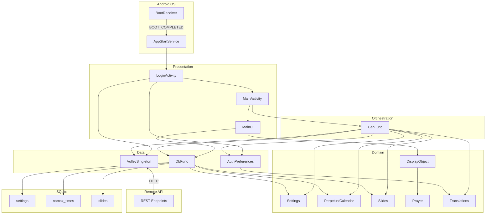

# MasjidWala TV — Smart Mosque Display System

[](https://github.com/dynasol/masjidwala-tv-android/releases)
[](https://developer.android.com/tv)
[](docs/api-integration-guide.md)
[-lightgrey?style=flat&logo=android&logoColor=white)](https://developer.android.com/about/versions/oreo)
[-4CAF50?style=flat&logo=android&logoColor=white)](https://developer.android.com/about/versions/14)
[](https://kotlinlang.org/)
[](https://developer.android.com/studio)
[]

**A Dynasol Technologies Production**

MasjidWala TV is a professional-grade digital signage and prayer time management system built for Android TV deployments in mosques. It provides real-time prayer schedule display, dynamic media carousels, Azan/Iqamah scheduling, and full offline resilience — all managed remotely via a cloud-based administration panel.

---

## 📚 What This Repository Contains

This repository serves as the **technical documentation and architecture reference** for the MasjidWala TV Android client. It includes:

- Complete system architecture diagrams and design decisions
- Database schema definitions and data flow documentation
- API integration patterns and sync strategy guides
- Module structure and layer separation documentation
- Implementation guides and best practices

> ⚠️ **Note:** Proprietary source code, trade secrets, and production implementation details are **not included** in this public repository. This documentation is provided for architectural reference and integration planning purposes.

---

## ✨ System Capabilities

| Feature | Description |
|---|---|
| **Auto-Sync Engine** | Periodic background sync for settings, prayer calendar, slides, and translations |
| **Offline Mode** | Full SQLite persistence ensures uninterrupted display even when network is unavailable |
| **Prayer Time Highlighting** | Real-time detection of the current prayer period with visual emphasis |
| **Iqamah Countdown** | Configurable countdown timer that transitions from "Next Prayer" to "Iqamah" mode |
| **Azan & Iqamah Scheduling** | Audio cue support for Azan call and Iqamah notification |
| **Image Carousel** | BLOB-persisted media slides displayed via ViewPager2 with configurable durations |
| **Dual-Language RTL/LTR Support** | Full Arabic (Urdu) and English UI rendering with dynamic layout direction switching |
| **Auto-Boot Launch** | Survives device reboots via BootReceiver → AppStartService foreground service chain |
| **Hijri Calendar Integration** | Displays the Islamic date alongside the Gregorian date |
| **Maslak-Aware Calculation** | Supports Hanafi and Shafi prayer time calculation methods |
| **Background Image Support** | Optional fullscreen background image stored and served as a BLOB |
| **QR Code / OTP Login** | Device registration via mobile OTP authentication flow |

---

## 🏗️ Architecture Overview



> For detailed architecture diagrams, see [`docs/architecture-overview.md`](docs/architecture-overview.md)

---

## 📂 Repository Structure

```
masjidwala-tv-android/
│
├── README.md                          # Project overview and documentation index
├── LICENSE                            # Proprietary license (All Rights Reserved)
│
├── docs/
│   ├── architecture-overview.md       # 3-layer design, component responsibilities
│   ├── api-integration-guide.md       # Endpoints, authentication, failure handling
│   ├── database-schema.md             # Tables, columns, types, constraints
│   ├── content-sync-strategy.md       # Sync algorithm, merge logic, fallback
│   ├── ui-state-management.md         # DisplayObject, timers, orientation
│   ├── media-slideshow-flow.md        # ViewPager2, BLOBs, progress animation
│   └── prayer-time-algorithms.md      # Pseudocode for time calculation
│
├── modules/
│   ├── data-layer.md                  # DbFunc, VolleySingleton, Database
│   ├── domain-layer.md                # Settings, Slides, Prayer models
│   └── presentation-layer.md         # MainActivity, MainUI, GenFunc
│
├── samples/
│   └── Settings.md                    # Complete Settings domain field reference
│
├── diagrams/
│   └── architecture.puml              # PlantUML system flow diagrams
│
└── screenshots/                       # UI reference images (if applicable)
```

---

## 🔧 Technology Stack

| Component | Technology |
|---|---|
| Language | Kotlin |
| UI Framework | Android Views + ConstraintLayout |
| Slideshow | ViewPager2 + Custom CarouselAdapter |
| Networking | Volley (CustomJsonObjectRequest) |
| Local Database | SQLite (SQLiteOpenHelper) |
| Preferences | SharedPreferences (AuthPreferences wrapper) |
| Background Service | Foreground Service + BroadcastReceiver |
| Animation | ValueAnimator / CountDownTimer |
| QR Code Generation | ZXing (MultiFormatWriter) |
| Minimum SDK | API 26 (Android 8.0) |
| Target SDK | API 34 (Android 14) |

---

## 🔒 Security & Compliance

| Aspect | Implementation |
|---|---|
| API Authentication | Bearer Token / Basic Auth via custom Volley interceptor |
| Credential Storage | SharedPreferences with MODE_PRIVATE |
| Source Code Protection | Proprietary code not included in public repository |
| RTL/LTR Support | Per-device persisted layout direction |
| Data Persistence | Encrypted BLOB storage for media content |

---

