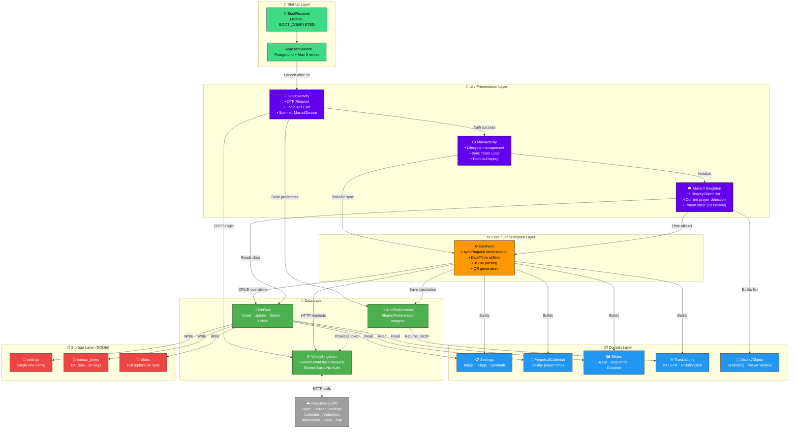

## Hafsaailyas
Update architecture.md  
064d7cf · now  

### Preview  

```mermaid
flowchart TD
    %% — Styling Definition
    classDef android fill:#3DDC84,stroke:#000,color:#000
    classDef ui fill:#6200EE,stroke:#000,color:#fff
    classDef core fill:#FF9800,stroke:#000,color:#000
    classDef domain fill:#2196F3,stroke:#000,color:#fff
    classDef data fill:#4CAF50,stroke:#000,color:#fff
    classDef api fill:#9E9E9E,stroke:#000,color:#fff
    classDef storage fill:#EF4444,stroke:#000,color:#fff

    subgraph STARTUP["🚀 Startup Layer"]
        A["📱 BootReceiver<br/>Listens: BOOT_COMPLETED"]
        B["🚀 AppStartService<br/>Foreground + Max 3 retries"]
    end

    subgraph UI["📱 UI / Presentation Layer"]
        C["🔐 LoginActivity<br/>• OTP Request<br/>• Login API Call<br/>• Spinner: Masjid/Device"]
        D["📺 MainActivity<br/>• Lifecycle management<br/>• Sync Timer Loop<br/>• Boot-to-Display"]
        F["🎮 MainUI Singleton<br/>• DisplayObject list<br/>• Current prayer detection<br/>• Prayer timer (1s interval)"]
    end

    subgraph CORE["⚙️ Core / Orchestration Layer"]
        E["⚙️ GenFunc<br/>• syncRequest orchestration<br/>• Date/Time utilities<br/>• JSON parsing<br/>• QR generation"]
    end

    subgraph DOMAIN["📦 Domain Layer"]
        K1["📋 Settings<br/>Masjid · Flags · Qiyamah"]
        K2["📅 PerpetualCalendar<br/>30-day prayer times"]
        K3["🖼️ Slides<br/>BLOB · Sequence · Duration"]
        K4["🌐 Translations<br/>RTL/LTR · Urdu/English"]
        K5["🎯 DisplayObject<br/>UI binding · Prayer window"]
    end

    subgraph DATA["💾 Data Layer"]
        G["🌐 VolleySingleton<br/>CustomJsonObjectRequest<br/>Bearer/Basic/No Auth"]
        H["💾 DbFunc<br/>Insert · Update · Delete · Exists"]
        M["🔑 AuthPreferences<br/>SharedPreferences wrapper"]
    end

    subgraph STORAGE["🗄️ Storage Layer (SQLite)"]
        J1["📄 settings<br/>Single row config"]
        J2["📄 namaz_times<br/>PK: date · 30 days"]
        J3["📄 slides<br/>Full replace on sync"]
    end

    I["☁️ MasjidWala API<br/>/sync · /screen_settings<br/>/calendar · /slideshow<br/>/translation · /login · /otp"]

    A --> B
    B -->|Launch after 5s| C
    C -->|Auth success| D
    C -->|OTP / Login| G
    C -->|Save preference| M
    D -->|Periodic sync| E
    D -->|Initialize| F
    E -->|HTTP requests| G
    E -->|CRUD operations| H
    E -->|Builds| K1 & K2 & K3 & K4
    E -->|Save translation| M
    F -->|Reads data| H
    F -->|Time utilities| E
    F -->|Builds list| K5
    G <-->|HTTP calls| I
    H -->|Write| J1 & J2 & J3
    H -->|Read| K1 & K2 & K3
    M -.->|Provides token| G
    M -->|Returns JSON| K4

    class A,B android
    class C,D,F ui
    class E core
    class K1,K2,K3,K4,K5 domain
    class G,H,M data
    class J1,J2,J3 storage
    class I api
```
