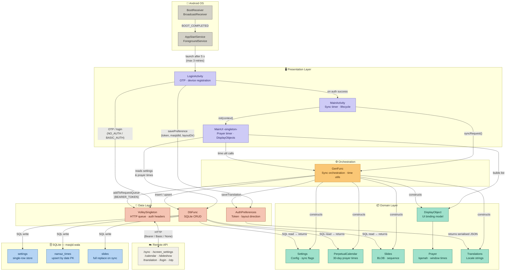

# MasjidWala TV — System Architecture

Render this diagram on [mermaid.live](https://mermaid.live) or push to GitHub — it renders natively in any `.md` file.

```mermaid
flowchart TD
    %% ── Android OS ─────────────────────────────────────────────
    subgraph OS["🤖 Android OS"]
        BOOT["BootReceiver\nBroadcastReceiver"]
        SVC["AppStartService\nForegroundService"]
    end

    %% ── Presentation ────────────────────────────────────────────
    subgraph PRES["🖥️ Presentation Layer"]
        LOGIN["LoginActivity\nOTP · device registration"]
        MAIN["MainActivity\nSync timer · lifecycle"]
        MAINUI["MainUI ‹singleton›\nPrayer timer · DisplayObjects"]
    end

    %% ── Orchestration ───────────────────────────────────────────
    subgraph ORCH["⚙️ Orchestration"]
        GEN["GenFunc\nSync orchestration · time utils"]
    end

    %% ── Domain ──────────────────────────────────────────────────
    subgraph DOM["📦 Domain Layer"]
        S["Settings\nConfig · sync flags"]
        PC["PerpetualCalendar\n30-day prayer times"]
        SL["Slides\nBLOB · sequence"]
        DO["DisplayObject\nUI binding model"]
        PR["Prayer\nIqamah · window times"]
        TR["Translations\nLocale strings"]
    end

    %% ── Data ────────────────────────────────────────────────────
    subgraph DATA["💾 Data Layer"]
        DB["DbFunc\nSQLite CRUD"]
        VS["VolleySingleton\nHTTP queue · auth headers"]
        AP["AuthPreferences\nToken · layout direction"]
    end

    %% ── Persistence ─────────────────────────────────────────────
    subgraph SQLITE["🗄️ SQLite — masjid.wala"]
        T1["settings\nsingle-row store"]
        T2["namaz_times\nupsert by date PK"]
        T3["slides\nfull replace on sync"]
    end

    %% ── Remote API ──────────────────────────────────────────────
    subgraph API["☁️ Remote API"]
        EP["/sync · /screen_settings\n/calendar · /slideshow\n/translation · /login · /otp"]
    end

    %% ── Connections ─────────────────────────────────────────────
    BOOT -->|"BOOT_COMPLETED"| SVC
    SVC  -->|"launch after 5 s\n(max 3 retries)"| LOGIN
    LOGIN -->|"on auth success"| MAIN
    LOGIN -->|"OTP / login\n(NO_AUTH / BASIC_AUTH)"| VS
    LOGIN -->|"savePreference\n(token, masjidId, layoutDir)"| AP

    MAIN  -->|"syncRequest()"| GEN
    MAIN  -->|"init(context)"| MAINUI
    MAINUI -->|"reads settings\n& prayer times"| DB
    MAINUI -->|"time util calls"| GEN
    MAINUI -->|"builds list"| DO
    DO --> PR

    GEN -->|"addToRequestQueue\n(BEARER_TOKEN)"| VS
    GEN -->|"insert / upsert"| DB
    GEN -->|"saveTranslation"| AP
    GEN -->|"constructs"| S & PC & SL & DO & TR

    VS  <-->|"HTTP\n(Bearer / Basic / None)"| EP

    DB  -->|"SQL write"| T1 & T2 & T3
    DB  -->|"SQL read → returns"| S & PC & SL
    AP  -->|"returns serialised JSON"| TR

    %% ── Styles ──────────────────────────────────────────────────
    classDef os      fill:#D3D1C7,stroke:#5F5E5A,color:#2C2C2A
    classDef pres    fill:#CECBF6,stroke:#534AB7,color:#26215C
    classDef orch    fill:#FAC775,stroke:#BA7517,color:#412402
    classDef domain  fill:#9FE1CB,stroke:#0F6E56,color:#04342C
    classDef data    fill:#F5C4B3,stroke:#993C1D,color:#4A1B0C
    classDef db      fill:#B5D4F4,stroke:#185FA5,color:#042C53
    classDef api     fill:#F1EFE8,stroke:#888780,color:#2C2C2A

    class BOOT,SVC os
    class LOGIN,MAIN,MAINUI pres
    class GEN orch
    class S,PC,SL,DO,PR,TR domain
    class DB,VS,AP data
    class T1,T2,T3 db
    class EP api
```
