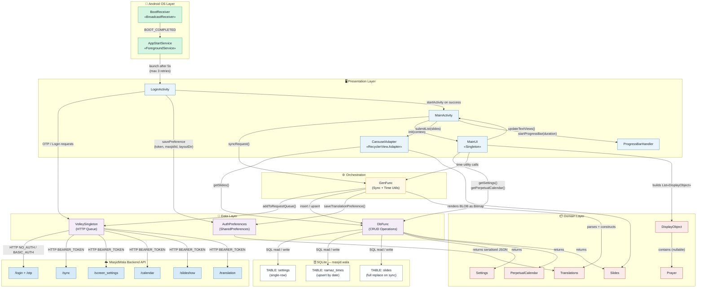

```mermaid
graph TB
    %% ============================================================
    %% MasjidWala TV — Component Architecture Diagram
    %% Renders natively on GitHub in any Markdown file
    %% ============================================================

    %% ── External ────────────────────────────────────────────────
    subgraph REMOTE["☁️ MasjidWala Backend API"]
        API_SYNC["/sync"]
        API_SETTINGS["/screen_settings"]
        API_CALENDAR["/calendar"]
        API_SLIDES["/slideshow"]
        API_TRANS["/translation"]
        API_LOGIN["/login + /otp"]
    end

    %% ── Android OS ──────────────────────────────────────────────
    subgraph OS["🤖 Android OS Layer"]
        BOOT["BootReceiver\n«BroadcastReceiver»"]
        SERVICE["AppStartService\n«ForegroundService»"]
    end

    %% ── Presentation ────────────────────────────────────────────
    subgraph PRESENTATION["🖥️ Presentation Layer"]
        LOGIN["LoginActivity"]
        MAIN["MainActivity"]
        MAINUI["MainUI\n«Singleton»"]
        CAROUSEL["CarouselAdapter\n«RecyclerView.Adapter»"]
        PROGRESS["ProgressBarHandler"]
    end

    %% ── Orchestration ───────────────────────────────────────────
    subgraph ORCH["⚙️ Orchestration"]
        GENFUNC["GenFunc\n(Sync + Time Utils)"]
    end

    %% ── Domain ──────────────────────────────────────────────────
    subgraph DOMAIN["📦 Domain Layer"]
        SETTINGS["Settings"]
        CALENDAR_OBJ["PerpetualCalendar"]
        PRAYER["Prayer"]
        DISPOBJ["DisplayObject"]
        SLIDES_OBJ["Slides"]
        TRANS_OBJ["Translations"]
    end

    %% ── Data ────────────────────────────────────────────────────
    subgraph DATA["💾 Data Layer"]
        DBFUNC["DbFunc\n(CRUD Operations)"]
        VOLLEY["VolleySingleton\n(HTTP Queue)"]
        AUTHPREFS["AuthPreferences\n(SharedPreferences)"]
    end

    %% ── Persistence ─────────────────────────────────────────────
    subgraph DB["🗄️ SQLite — masjid.wala"]
        TBL_SETTINGS["TABLE: settings\n(single-row)"]
        TBL_NAMAZ["TABLE: namaz_times\n(upsert by date)"]
        TBL_SLIDES["TABLE: slides\n(full replace on sync)"]
    end

    %% ── Boot Flow ───────────────────────────────────────────────
    BOOT -->|"BOOT_COMPLETED"| SERVICE
    SERVICE -->|"launch after 5s\n(max 3 retries)"| LOGIN

    %% ── Auth Flow ───────────────────────────────────────────────
    LOGIN -->|"OTP / Login requests"| VOLLEY
    VOLLEY -->|"HTTP NO_AUTH / BASIC_AUTH"| API_LOGIN
    LOGIN -->|"savePreference\n(token, masjidId, layoutDir)"| AUTHPREFS
    LOGIN -->|"startActivity on success"| MAIN

    %% ── Sync Flow ───────────────────────────────────────────────
    MAIN -->|"syncRequest()"| GENFUNC
    GENFUNC -->|"addToRequestQueue()"| VOLLEY
    VOLLEY -->|"HTTP BEARER_TOKEN"| API_SYNC
    VOLLEY -->|"HTTP BEARER_TOKEN"| API_SETTINGS
    VOLLEY -->|"HTTP BEARER_TOKEN"| API_CALENDAR
    VOLLEY -->|"HTTP BEARER_TOKEN"| API_SLIDES
    VOLLEY -->|"HTTP BEARER_TOKEN"| API_TRANS
    GENFUNC -->|"insert / upsert"| DBFUNC
    GENFUNC -->|"saveTranslationPreference()"| AUTHPREFS

    %% ── DB Persistence ──────────────────────────────────────────
    DBFUNC -->|"SQL read / write"| TBL_SETTINGS
    DBFUNC -->|"SQL read / write"| TBL_NAMAZ
    DBFUNC -->|"SQL read / write"| TBL_SLIDES

    %% ── UI Flow ─────────────────────────────────────────────────
    MAIN -->|"init(context)"| MAINUI
    MAINUI -->|"getSettings()\ngetPerpetualCalendar()"| DBFUNC
    MAINUI -->|"time utility calls"| GENFUNC
    MAINUI -->|"builds List«DisplayObject»"| DISPOBJ
    DISPOBJ -->|"contains (nullable)"| PRAYER
    MAINUI -->|"updateTextViews()"| MAIN
    MAIN -->|"submitList(slides)"| CAROUSEL
    CAROUSEL -->|"getSlides()"| DBFUNC
    CAROUSEL -->|"renders BLOB as Bitmap"| SLIDES_OBJ
    MAIN -->|"startProgressBar(duration)"| PROGRESS

    %% ── Domain ↔ Data ───────────────────────────────────────────
    DBFUNC -->|"returns"| SETTINGS
    DBFUNC -->|"returns"| CALENDAR_OBJ
    DBFUNC -->|"returns"| SLIDES_OBJ
    AUTHPREFS -->|"returns serialised JSON"| TRANS_OBJ
    GENFUNC -->|"parses + constructs"| TRANS_OBJ

    %% ── Styling ─────────────────────────────────────────────────
    classDef remote    fill:#D6EAF8,stroke:#2E86C1,color:#1A252F
    classDef os        fill:#D5F5E3,stroke:#27AE60,color:#1A252F
    classDef present   fill:#EAF4FB,stroke:#2980B9,color:#1A252F
    classDef orch      fill:#FEF9E7,stroke:#F39C12,color:#1A252F
    classDef domain    fill:#F9EBEA,stroke:#C0392B,color:#1A252F
    classDef data      fill:#F4ECF7,stroke:#8E44AD,color:#1A252F
    classDef db        fill:#FDFEFE,stroke:#717D7E,color:#1A252F

    class API_SYNC,API_SETTINGS,API_CALENDAR,API_SLIDES,API_TRANS,API_LOGIN remote
    class BOOT,SERVICE os
    class LOGIN,MAIN,MAINUI,CAROUSEL,PROGRESS present
    class GENFUNC orch
    class SETTINGS,CALENDAR_OBJ,PRAYER,DISPOBJ,SLIDES_OBJ,TRANS_OBJ domain
    class DBFUNC,VOLLEY,AUTHPREFS data
    class TBL_SETTINGS,TBL_NAMAZ,TBL_SLIDES db
```
