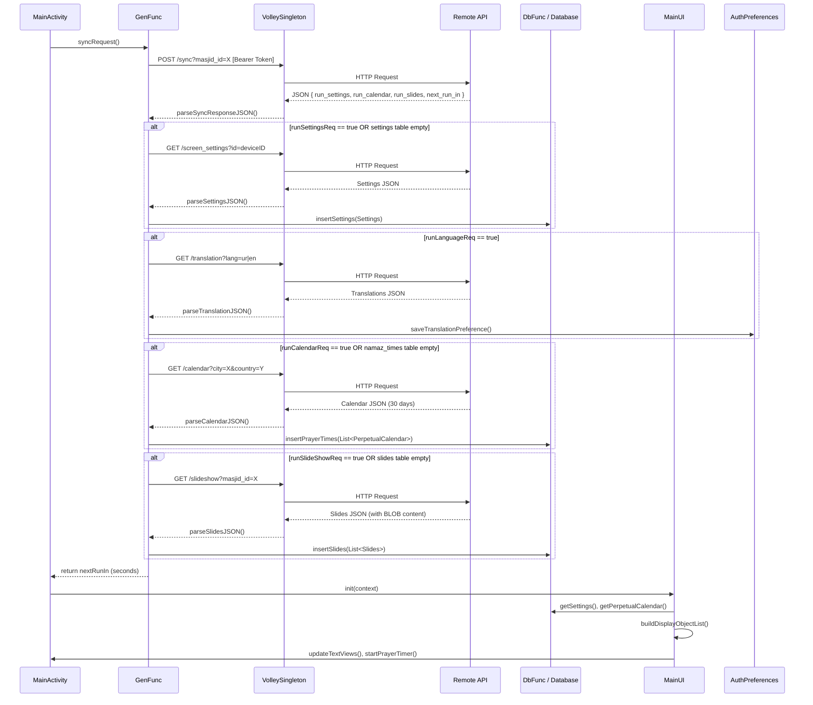

# Architecture Overview — MasjidWala TV

## Introduction

MasjidWala TV is structured as a **three-layer Android application** following a simplified clean-architecture pattern adapted for embedded TV environments. Each layer has a clearly defined responsibility, and communication flows downward (Presentation → Domain → Data), with callbacks and coroutines propagating results back up.

---

## Layer Definitions

### 1. Presentation Layer

Responsible for all user-facing display logic, lifecycle management, and UI state transitions.

**Key Components:**

- **`MainActivity`** — The primary activity. Orchestrates the boot-to-display lifecycle: checks for stored credentials, triggers the initial sync via `GenFunc`, initialises `MainUI`, and starts the periodic sync timer.
- **`LoginActivity`** — Handles device registration. Collects the administrator's mobile number, requests an OTP from the API, validates it, and persists credentials via `AuthPreferences`.
- **`MainUI`** (Singleton) — Manages the `List<DisplayObject>` that backs every visible UI cell. Holds `TextView` references resolved at runtime by `object_container_id`. Drives the `prayerTimer` (`fixedRateTimer`) for live countdown display.
- **`GenFunc`** — General-purpose orchestration class. Handles all API calls (via `VolleySingleton`), all JSON parsing, time-calculation utilities, and the construction of `DisplayObject` instances from raw domain data.

---

### 2. Domain Layer

Pure data models with no Android framework dependencies. These objects are constructed by `GenFunc`, persisted by `DbFunc`, and consumed by `MainUI`.

| Class | Purpose |
|---|---|
| `Settings` | All masjid-specific configuration (prayer visibility, Iqamah times, sync flags, audio toggles) |
| `PerpetualCalendar` | A single day's prayer time record (Fajr through Isha, Hijri date, Gregorian metadata) |
| `Prayer` | Per-prayer sub-object: starting time, Iqamah time, ending time, ending label, next prayer reference |
| `DisplayObject` | A UI-bindable view model: maps a named display slot to its label, value, time window, and prayer metadata |
| `Slides` | A single media slide: BLOB content, sequence order, display duration, fullscreen flag, Iqamah-screen flag |
| `Translations` | Locale-specific string overrides for all UI labels and messages |

---

### 3. Data Layer

Responsible for all persistence and network I/O.

**Key Components:**

- **`Database`** (`SQLiteOpenHelper`) — Schema definition and DDL execution for all three tables (`settings`, `namaz_times`, `slides`).
- **`DbFunc`** — CRUD operations wrapping `Database`. All reads return domain objects; all writes accept domain objects.
- **`VolleySingleton`** — Application-scoped singleton HTTP request queue. Exposes `CustomJsonObjectRequest` which injects the correct `Authorization` header based on the `AuthType` enum (`NO_AUTH`, `BASIC_AUTH`, `BEARER_TOKEN`).
- **`AuthPreferences`** — `SharedPreferences` wrapper for persisting the device token, masjid ID, layout direction, and translation blob.

---

## Sync Sequence Flow

The following Mermaid diagram describes the complete data synchronisation flow initiated on app launch and repeated on a configurable interval:



---

## Boot-to-Display Flow

```
Device Power On
      │
      ▼
BootReceiver.onReceive(BOOT_COMPLETED)
      │
      ▼
AppStartService.onCreate() ── startForeground()
      │   [5 second delay, up to 3 retries]
      ▼
LoginActivity
      │  [credentials exist in AuthPreferences?]
      ├── YES ──► MainActivity
      └── NO  ──► OTP Login Flow ──► MainActivity
                                          │
                                    syncRequest()
                                          │
                                    MainUI.init()
                                          │
                                    prayerTimer starts
                                          │
                                    SlideShow starts
```

---

## Offline Resilience

Every network operation is wrapped in a try/catch with a defined fallback:

1. **Settings sync fails** → `DbFunc.getSettings()` returns the last successfully stored `Settings` object.
2. **Calendar sync fails** → `DbFunc.getPerpetualCalendar(today)` reads today's prayer times from the local `namaz_times` table.
3. **Slides sync fails** → `DbFunc.getSlides()` returns the previously cached BLOB list from the `slides` table.
4. **All data missing (first boot, no network)** → Default-value domain objects are used. The UI renders with placeholder text until connectivity is restored.

The sync interval (`nextRequestRunIn`) is set by the server in each sync response, defaulting to 10 minutes when unavailable.
